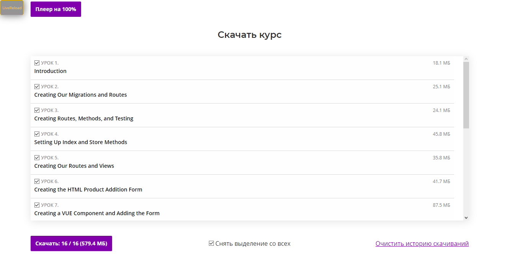
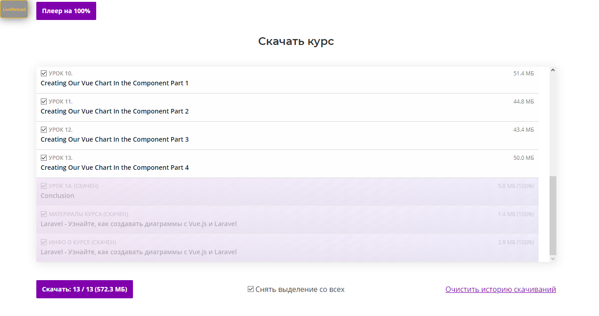
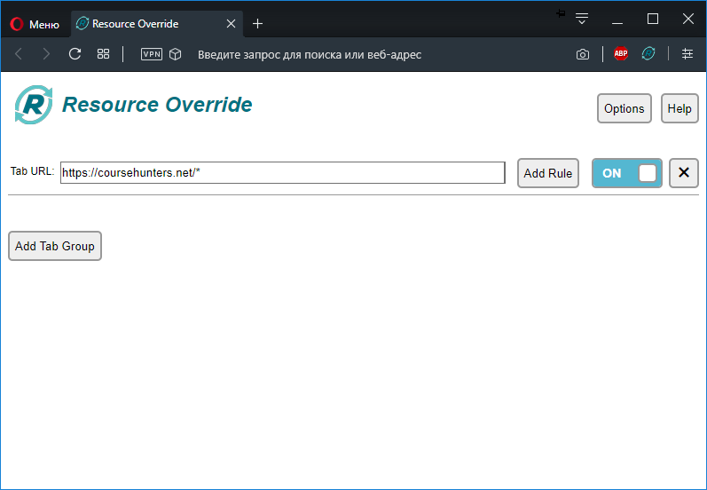
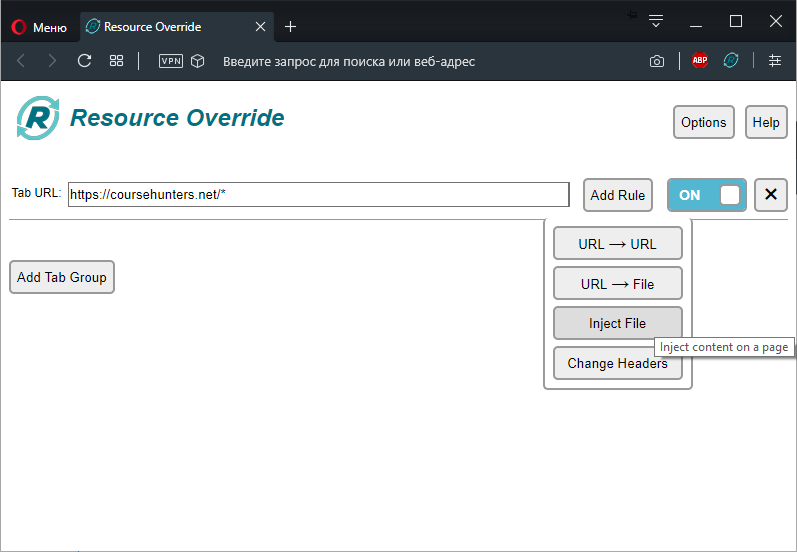
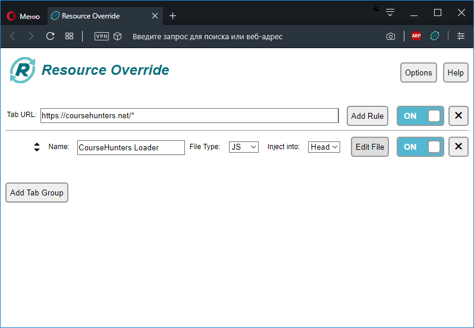
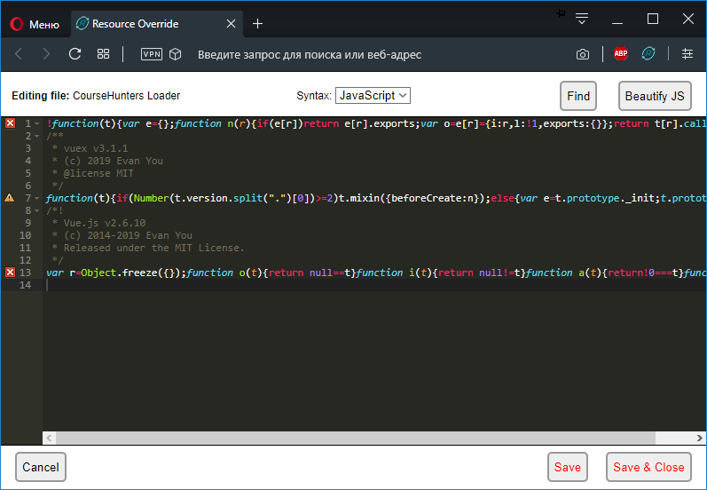

# CourseHunters Loader
Скрипт, запускаемый на странице курса [**coursehunters.net**](https://coursehunters.net) для скачивания уроков и материалов курса.

Запустившись на странице курса, этот скрипт создает новый блок страницы со списком уроков для скачивания. 

Есть возможность скачивать нужные уроки по отдельности. К списку уроков добавлены пункты с Материалами курса и Информацией о курсе. Удобное отображение и сохранение прогресса скачивания: скачав только часть уроков, а позже вернувшись на стрницу для скачивания оставшихся, ранее скаченные сразу будут отмечены.

## Использование
1. Самый простой вариант для единоразового использования - скопировать содержимое скрипта [***main.js***](https://raw.githubusercontent.com/neyasbltb88/coursehunters-loader-v2/master/build/main.js) и вставить его в консоль на странице нужного курса. При этом скрипт будет работать до перезагрузки страницы.

2. Для постоянной подгрузки скрипта на страницы курсов, необходимо использовать расширение браузера, которое позволит добавлять собственные скрипты на выбранные сайты. Для примера возьмем расширение [**Resource Override**](https://chrome.google.com/webstore/detail/resource-override/pkoacgokdfckfpndoffpifphamojphii?hl=ru).

    Создать новое правило для адреса `https://coursehunters.net/*`:
    

    Нажать `Add Rule` и выбрать `Inject File`:
    

    Заполнить имя скрипта(необязательно, но нужно чтобы не перепутать с другими скриптами, если их будет несколько для этого адреса сайта), `File Type` должен быть `JS`, и нажать `Edit File`:
    

    В открывшийся редактор кода нужно вставить содержимое скрипта [***main.js***](https://raw.githubusercontent.com/neyasbltb88/coursehunters-loader-v2/master/build/main.js) и нажать `Save & Close`:
    

    Можно закрывать вкладку Resource Override, переходить на страницу лбого курса и скачивать все, что хочется.

